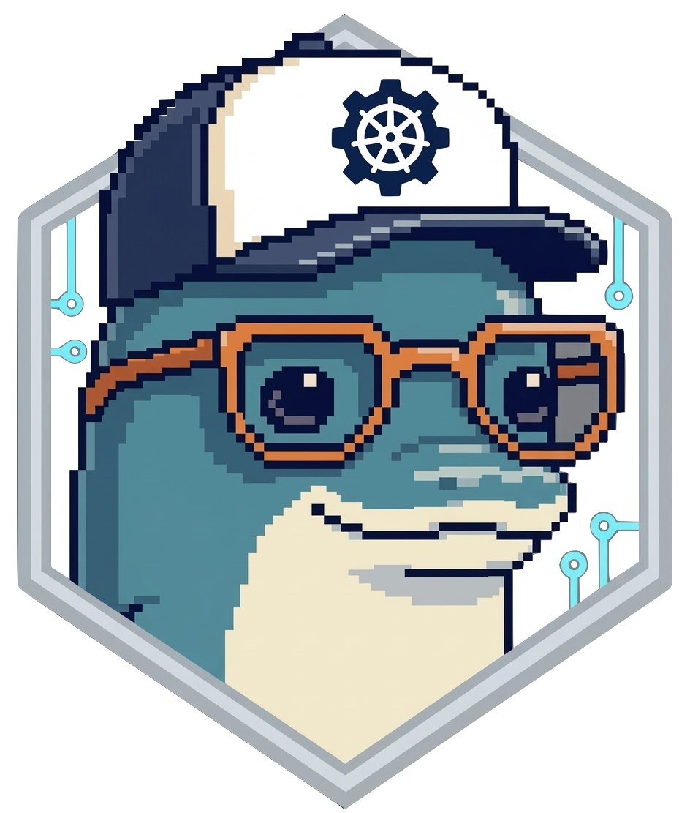

<p align="center">
  
</p>

<h1 align="center">Porpulsion</h1>

<p align="center">
  Peer-to-peer Kubernetes connector. Deploy workloads across clusters over mutual TLS - no VPN, no service mesh, no central control plane.
</p>

---

```
┌──────────────────────┐                      ┌──────────────────────┐
│  Cluster A           │                      │  Cluster B           │
│  ┌────────────────┐  │  persistent WebSocket │  ┌────────────────┐  │
│  │   porpulsion   │◄─┼──────────────────────┼─►│   porpulsion   │  │
│  │  :8001 peer    │  │  RemoteApp deploy    │  │  :8001 peer    │  │
│  │  :8000 UI+API  │  │  status callbacks    │  │  :8000 UI+API  │  │
│  │  :8002 probes  │  │  HTTP proxy tunnel   │  │  :8002 probes  │  │
│  └────────────────┘  │                      │  └────────────────┘  │
└──────────────────────┘                      └──────────────────────┘
```

## How it works

Each cluster runs one porpulsion agent. Agents exchange self-signed CA certificates during a one-time peering handshake, authenticated by a single-use invite token.

After peering, each agent opens a **persistent WebSocket channel** to its peer on port 8001. All subsequent inter-agent traffic - RemoteApp submissions, status callbacks, HTTP proxy tunnels - flows over this single long-lived connection. No new outbound connections are made per request. If the channel drops, both sides reconnect automatically with exponential backoff.

State (peers, submitted apps, settings) is persisted to a Kubernetes Secret and ConfigMap so restarts are transparent.

---

## Prerequisites

- Docker + Docker Compose (local dev)
- Kubernetes + Helm 3 (production)
- No local `kubectl` needed for local dev - all commands run via `docker exec`

---

## Local Development

```sh
git clone https://github.com/hartyporpoise/porpulsion
cd porpulsion
make deploy
```

`make deploy` does everything from scratch:

1. Starts two k3s clusters and a Helm runner container via docker-compose
2. Builds the `porpulsion-agent:local` image
3. Loads it into both clusters (no registry needed)
4. Helm-installs porpulsion into both clusters with NodePort services
5. Agents are ready to peer

| URL | Description |
|-----|-------------|
| `http://localhost:8001` | Cluster A dashboard |
| `http://localhost:8002` | Cluster B dashboard |

### Makefile targets

```sh
make deploy    # Full deploy from scratch (start clusters, build, helm install)
make redeploy  # Rebuild image + helm upgrade (clusters keep running)
make teardown  # Destroy everything (docker-compose down -v)
make status    # Show pods and peer status for both clusters
make logs      # Tail live agent logs from both clusters
make clean-ns  # Remove porpulsion namespace from both clusters
```

---

## Production Install

```sh
helm upgrade --install porpulsion oci://ghcr.io/hartyporpoise/porpulsion \
  --create-namespace \
  --namespace porpulsion \
  --set agent.agentName=my-cluster \
  --set agent.selfUrl=https://porpulsion.example.com
```

The agent runs three servers on separate ports:

| Port | Purpose | Exposure |
|------|---------|----------|
| **8000** | Dashboard UI + management API (session auth) | Internal only - `kubectl port-forward` |
| **8001** | Peer handshake (`/peer`) + WebSocket channel (`/ws`) | Expose via Ingress |
| **8002** | Health probes (`/status`) - no auth | Internal only - kubelet only |

```sh
# Access the dashboard locally
kubectl port-forward svc/porpulsion 8000:8000 -n porpulsion
```

### nginx Ingress example

Only port 8001 (the peer-facing server) is exposed. The dashboard stays internal.

Two annotations are required:

- **`websocket-services`** - tells the ingress controller to proxy the WebSocket upgrade correctly (sets `proxy_http_version 1.1` and the `Upgrade`/`Connection` headers)
- **`proxy-read-timeout` / `proxy-send-timeout`** - must be longer than the agent's ping interval (20s); the default 60s will cause the persistent channel to drop during quiet periods

```yaml
apiVersion: networking.k8s.io/v1
kind: Ingress
metadata:
  name: porpulsion
  namespace: porpulsion
  annotations:
    # Required: allows the WS upgrade to pass through nginx correctly.
    nginx.ingress.kubernetes.io/websocket-services: "porpulsion"
    # Keep the persistent WebSocket channel alive during quiet periods.
    nginx.ingress.kubernetes.io/proxy-read-timeout: "3600"
    nginx.ingress.kubernetes.io/proxy-send-timeout: "3600"
spec:
  ingressClassName: nginx
  tls:
    - hosts:
        - porpulsion.example.com
      secretName: porpulsion-tls   # your TLS cert (e.g. cert-manager / Let's Encrypt)
  rules:
    - host: porpulsion.example.com
      http:
        paths:
          - path: /peer
            pathType: Prefix
            backend:
              service:
                name: porpulsion
                port:
                  number: 8001
          - path: /ws
            pathType: Prefix
            backend:
              service:
                name: porpulsion
                port:
                  number: 8001
```

> **Encryption**: set `agent.selfUrl` to `https://porpulsion.example.com` and all peer WebSocket channels will use `wss://` (TLS via nginx). If `selfUrl` is `http://` the channel falls back to unencrypted `ws://` - the dashboard shows a yellow **live** badge as a warning.

Set `agent.selfUrl` to `https://porpulsion.example.com` in your Helm values.

### Helm values

| Value | Default | Description |
|-------|---------|-------------|
| `agent.agentName` | `""` | Human-readable cluster name shown in the dashboard |
| `agent.selfUrl` | `""` | Externally reachable URL for this agent. Peers use it for the initial invite handshake and the persistent WebSocket channel. Set to the nginx HTTPS hostname, e.g. `https://porpulsion.example.com`. Auto-detected if unset. |
| `agent.image` | `porpulsion-agent:latest` | Container image |
| `agent.pullPolicy` | `IfNotPresent` | Image pull policy |
| `namespace` | `porpulsion` | Namespace for the agent and all RemoteApp workloads |
| `service.type` | `ClusterIP` | Service type - use `NodePort` for local dev |
| `service.port` | `8000` | Dashboard UI and management API - session auth required (internal only) |
| `service.uiNodePort` | `""` | NodePort for dashboard (only when `type=NodePort`) |
| `service.peerPort` | `8001` | Peer handshake + WebSocket channel (expose via Ingress) |
| `service.peerNodePort` | `""` | NodePort for peer server (only when `type=NodePort`) |
| `service.internalPort` | `8002` | Health/readiness probes - no auth (internal only) |
| `service.internalNodePort` | `""` | NodePort for internal server (only when `type=NodePort`) |

---

## Settings

Managed per-agent from the **Settings** page in the dashboard.

### Access control

| Setting | Default | Description |
|---------|---------|-------------|
| Allow inbound workloads | `true` | Accept RemoteApp submissions from peers |
| Require manual approval | `false` | Queue inbound apps for approval before executing |
| Allowed image prefixes | _(empty)_ | Comma-separated list; empty = allow all |
| Blocked image prefixes | _(empty)_ | Always rejected regardless of allowed list |
| Allowed source peers | _(empty)_ | Comma-separated peer names; empty = all connected |

### Resource quotas

Enforced on **inbound** workloads at receive time. All CPU/memory values are k8s quantity strings.

| Setting | Description |
|---------|-------------|
| Require resource requests | Reject apps that omit `resources.requests.cpu` or `.memory` |
| Require resource limits | Reject apps that omit `resources.limits.cpu` or `.memory` |
| Max CPU request per pod | e.g. `500m` |
| Max CPU limit per pod | e.g. `1` |
| Max memory request per pod | e.g. `128Mi` |
| Max memory limit per pod | e.g. `256Mi` |
| Max replicas per app | Integer; `0` = unlimited |
| Max concurrent deployments | Integer; `0` = unlimited |
| Max total pods | Integer; `0` = unlimited |
| Max total CPU requests | e.g. `8` (aggregate across all running apps) |
| Max total memory requests | e.g. `32Gi` (aggregate across all running apps) |

---

## Usage

### 1 · Peer two clusters

Open the dashboard on Cluster A and navigate to **Peers**. Copy the invite token and CA fingerprint. On Cluster B, paste them into the **Connect a New Peer** form. Both sides will show the peer as connected within a few seconds.

Peers persist across restarts - the CA cert is stored in the `porpulsion-credentials` Secret. The WebSocket channel reconnects automatically on restart with exponential backoff starting at 2s.

### 2 · Deploy a RemoteApp

On the **Overview** page, enter an app name and fill in the YAML spec, then click **Deploy to Peer**.

```yaml
image: nginx:latest
replicas: 2
ports:
  - port: 80
    name: http
resources:
  requests:
    cpu: 250m
    memory: 128Mi
  limits:
    cpu: 500m
    memory: 256Mi
```

The spec is forwarded to the peer cluster over the WebSocket channel, which creates a Kubernetes Deployment in the `porpulsion` namespace. Status reflects back automatically (`Pending` → `Running`).

### 3 · Access via HTTP proxy

Navigate to the **Proxy** page to see all submitted apps with per-port proxy URLs. Click a URL to open the app through the WebSocket tunnel - no additional ports need to be exposed on the executing cluster.

Proxy URL format: `http://<dashboard>/remoteapp/<id>/proxy/<port>/`

---

## RemoteApp Spec

| Field | Type | Default | Description |
|-------|------|---------|-------------|
| `image` | string | **required** | Container image, e.g. `nginx:latest` |
| `replicas` | integer | `1` | Pod replica count |
| `ports` | list | `[]` | Ports to expose via HTTP proxy. Each entry: `port` (required), `name` (optional) |
| `resources` | object | - | Kubernetes resource requests and limits. Contains `requests` and/or `limits` with `cpu` (e.g. `250m`, `1`) and `memory` (e.g. `128Mi`, `2Gi`) quantity strings |
| `command` | list | - | Override container ENTRYPOINT, e.g. `["/bin/sh", "-c"]` |
| `args` | list | - | Override container CMD / arguments |
| `env` | list | - | Environment variables. Each entry: `name` + `value`, or `valueFrom.secretKeyRef` / `valueFrom.configMapKeyRef` |
| `imagePullPolicy` | string | `IfNotPresent` | `Always`, `IfNotPresent`, or `Never` |
| `imagePullSecrets` | list | - | Names of k8s Secrets containing registry credentials |
| `readinessProbe` | object | - | `httpGet` (`path`, `port`) or `exec` (`command`), plus `initialDelaySeconds`, `periodSeconds`, `failureThreshold` |
| `securityContext` | object | - | `runAsNonRoot`, `runAsUser`, `runAsGroup`, `fsGroup`, `readOnlyRootFilesystem` |

---

## API Reference

All API endpoints are on port 8000 and require a valid session (log in via the dashboard first). Use `curl` with session cookies or a browser session.

### Authentication

API endpoints accept either a session cookie (browser) or HTTP Basic Auth (scripts/curl).

```sh
# Basic Auth - simplest for scripting
curl -u admin:yourpassword http://localhost:8000/api/peers

# Or save a session cookie and reuse it
curl -c cookies.txt -X POST http://localhost:8000/login \
  -d "username=admin&password=yourpassword"
curl -u admin:yourpassword http://localhost:8000/api/peers
```

---

### Peers

#### `GET /api/peers`
List all connected and pending peers.

```sh
curl -u admin:yourpassword http://localhost:8000/api/peers
```
```json
[
  {
    "name": "cluster-b",
    "url": "https://porpulsion-b.example.com",
    "connected_at": "2026-03-03T02:00:00Z",
    "channel": "connected"
  }
]
```

#### `POST /api/peers/connect`
Initiate peering with another agent.

```sh
curl -u admin:yourpassword -X POST http://localhost:8000/api/peers/connect \
  -H "Content-Type: application/json" \
  -d '{
    "url": "https://porpulsion-b.example.com",
    "invite_token": "abc123...",
    "ca_fingerprint": "sha256:deadbeef..."
  }'
```

#### `DELETE /api/peers/<name>`
Remove a peer and clean up all associated workloads.

```sh
curl -u admin:yourpassword -X DELETE http://localhost:8000/api/peers/cluster-b
```

#### `GET /api/token`
Get this agent's invite token and CA fingerprint (share with a peer operator to initiate peering).

```sh
curl -u admin:yourpassword http://localhost:8000/api/token
```
```json
{
  "agent": "cluster-a",
  "namespace": "porpulsion",
  "invite_token": "abc123...",
  "self_url": "https://porpulsion-a.example.com",
  "cert_fingerprint": "sha256:deadbeef..."
}
```

---

### Workloads

#### `GET /api/remoteapps`
List all submitted and executing apps.

```sh
curl -u admin:yourpassword http://localhost:8000/api/remoteapps
```
```json
{
  "submitted": [
    {
      "id": "75cf6eef",
      "name": "my-nginx",
      "target_peer": "cluster-b",
      "status": "Running",
      "created_at": "2026-03-03T02:00:00Z"
    }
  ],
  "executing": []
}
```

#### `POST /api/remoteapp`
Deploy an app to a peer (or all peers with `"*"`).

```sh
curl -u admin:yourpassword -X POST http://localhost:8000/api/remoteapp \
  -H "Content-Type: application/json" \
  -d '{
    "name": "my-nginx",
    "target_peer": "cluster-b",
    "spec": {
      "image": "nginx:latest",
      "replicas": 2,
      "ports": [{"port": 80, "name": "http"}],
      "resources": {
        "requests": {"cpu": "100m", "memory": "64Mi"},
        "limits":   {"cpu": "250m", "memory": "128Mi"}
      }
    }
  }'
```

#### `DELETE /api/remoteapp/<id>`
Delete a submitted or executing app.

```sh
curl -u admin:yourpassword -X DELETE http://localhost:8000/api/remoteapp/75cf6eef
```

#### `POST /api/remoteapp/<id>/scale`
Scale an app to a new replica count.

```sh
curl -u admin:yourpassword -X POST http://localhost:8000/api/remoteapp/75cf6eef/scale \
  -H "Content-Type: application/json" \
  -d '{"replicas": 3}'
```

#### `GET /api/remoteapp/<id>/detail`
Get runtime detail for an app (pod status, events, recent logs).

```sh
curl -u admin:yourpassword http://localhost:8000/api/remoteapp/75cf6eef/detail
```

#### `GET /api/remoteapp/<id>/logs`
Stream recent logs from an executing app.

```sh
curl -u admin:yourpassword "http://localhost:8000/api/remoteapp/75cf6eef/logs?lines=100"
```

#### `PUT /api/remoteapp/<id>/spec`
Update the full spec of a submitted app and re-deploy.

```sh
curl -u admin:yourpassword -X PUT http://localhost:8000/api/remoteapp/75cf6eef/spec \
  -H "Content-Type: application/json" \
  -d '{"image": "nginx:1.27", "replicas": 1}'
```

---

### HTTP Proxy / Tunnels

Access a port on a remote app through the WebSocket tunnel - no extra ports needed on the executing cluster.

```
GET /api/remoteapp/<id>/proxy/<port>/
GET /api/remoteapp/<id>/proxy/<port>/<path>
```

```sh
# Open in a browser or curl - proxied through the WS channel to the executing cluster
curl -u admin:yourpassword http://localhost:8000/api/remoteapp/75cf6eef/proxy/80/
```

---

### Settings

#### `GET /api/settings`
Get current agent settings.

```sh
curl -u admin:yourpassword http://localhost:8000/api/settings
```

#### `POST /api/settings`
Update one or more settings.

```sh
curl -u admin:yourpassword -X POST http://localhost:8000/api/settings \
  -H "Content-Type: application/json" \
  -d '{"allow_inbound_remoteapps": true, "require_remoteapp_approval": false}'
```

---

### Internal (port 8002, no auth)

#### `GET /status`
Health and readiness probe - used by the kubelet. Returns agent name, peer count, and app counts.

```sh
curl http://localhost:8002/status
```
```json
{
  "agent": "cluster-a",
  "peers": [{"name": "cluster-b", "url": "https://..."}],
  "local_apps": 1,
  "remote_apps": 0
}
```

---

## Architecture

```
porpulsion/
├── porpulsion/
│   ├── agent.py              # Flask app entry point, blueprint registration, session config
│   ├── peer_server.py        # Port 8001 - peer handshake (/peer) + WebSocket (/ws)
│   ├── internal_server.py    # Port 8002 - health probes (/status), no auth
│   ├── state.py              # Shared in-memory state (peers, settings, channels)
│   ├── models.py             # Peer, RemoteApp, RemoteAppSpec, AgentSettings
│   ├── peering.py            # Peering handshake, CA cert exchange
│   ├── channel.py            # Persistent WebSocket channel (send/recv, reconnect)
│   ├── channel_handlers.py   # Handlers for incoming WS message types
│   ├── tls.py                # CA/cert generation, k8s Secret/ConfigMap persistence
│   ├── routes/
│   │   ├── peers.py          # /api/peers, /api/peers/connect, /api/token, etc.
│   │   ├── workloads.py      # /api/remoteapp, /api/remoteapps, /api/remoteapp/<id>/*
│   │   ├── tunnels.py        # /api/remoteapp/<id>/proxy/* (HTTP reverse proxy over WS)
│   │   ├── settings.py       # /api/settings
│   │   ├── logs.py           # /api/logs
│   │   ├── notifications.py  # /api/notifications
│   │   ├── auth.py           # /login, /logout, /signup, /users
│   │   ├── ui.py             # Dashboard pages: /, /peers, /workloads, /deploy, /tunnels, /settings, /docs
│   │   └── ws.py             # WebSocket auth (CA fingerprint matching)
│   └── k8s/
│       ├── executor.py       # Creates/updates/deletes Kubernetes Deployments
│       ├── store.py          # RemoteApp + ExecutingApp CR CRUD (k8s CRDs as source of truth)
│       └── tunnel.py         # Resolves pod IP from labels, proxies HTTP
├── templates/
│   ├── base.html             # Layout, nav, theme; all pages extend this
│   ├── ui/                   # Page templates (overview, peers, workloads, tunnels, logs, settings, docs)
│   └── macros/               # Shared Jinja2 macros (cards, badges)
├── static/
│   ├── css/app.css           # Mobile-first layout, light/dark theme
│   ├── js/api.js              # API client (/api/* endpoints)
│   ├── js/app.js              # Toast, theme, DOM helpers; builds window.Porpulsion
│   ├── js/pages.js            # Page refresh, render, form bindings
│   └── logo.png
├── charts/porpulsion/        # Helm chart
│   ├── Chart.yaml
│   ├── values.yaml
│   └── templates/
│       ├── deployment.yaml
│       ├── service.yaml
│       ├── role.yaml
│       ├── rolebinding.yaml
│       ├── clusterrole.yaml
│       ├── clusterrolebinding.yaml
│       ├── serviceaccount.yaml
│       └── secret.yaml
├── Dockerfile
├── docker-compose.yml
├── Makefile
└── requirements.txt
```

### WebSocket channel

After peering completes, each agent opens a persistent WebSocket connection to its peer's `/ws` endpoint. Authentication uses the CA fingerprint sent in the `X-Agent-Ca` header (base64-encoded PEM) - no client certificate is needed for the WS upgrade, which avoids nginx client-cert-forwarding complexity.

Both sides attempt to connect outbound on startup. Whichever side connects first becomes the active channel; the other side's outbound attempt arrives as an inbound connection and replaces it cleanly. The channel reconnects automatically with exponential backoff (2s → 4s → 8s → 16s → 30s); backoff resets to 2s after each successful connection.

All peer-to-peer messages are framed as JSON:

| Frame | Format | Description |
|-------|--------|-------------|
| Request | `{"id":"<hex>","type":"<method>","payload":{}}` | Expects a reply |
| Reply | `{"id":"<same>","type":"reply","ok":true,"payload":{}}` | Response to a request |
| Push | `{"type":"<event>","payload":{}}` | Fire-and-forget |

### State persistence

| Data | Store | Notes |
|------|-------|-------|
| CA cert + invite token | `porpulsion-credentials` Secret | Generated once, reused on restart |
| Peers (name, URL, CA cert) | `porpulsion-credentials` Secret | Written on every peer add/remove |
| Submitted apps | `RemoteApp` CRs (`remoteapps.porpulsion.io`) | Created on submit, deleted on remove |
| Executing apps | `ExecutingApp` CRs (`executingapps.porpulsion.io`) | Created on receive, deleted on remove |
| Pending approval queue | `porpulsion-state` ConfigMap | Written on enqueue, approve, and reject |
| Settings | `porpulsion-state` ConfigMap | Written on every settings change |

### Security model

- Every agent generates a private CA on first boot. The CA cert is what peers exchange - never the private key.
- The peering handshake is bootstrapped over plain HTTPS (verify=False) with a single-use invite token. The CA fingerprint is pinned by the connecting operator before peering completes, preventing MITM.
- WebSocket connections authenticate by CA fingerprint - the connecting peer sends its CA PEM (base64-encoded) in the `X-Agent-Ca` header, verified against all known peer CAs.
- Invite tokens are single-use and rotated after every successful peering handshake.
- The HTTP proxy only routes to pods labelled `porpulsion.io/remote-app-id` - it cannot reach arbitrary pods.
- RBAC is scoped to the `porpulsion` namespace with only the permissions needed (Deployments, Services, the credentials Secret, the state ConfigMap).

---

## Roadmap

- [ ] `kubectl apply -f` support via CRD controller
- [ ] CLI (`porpulsion peer add`, `porpulsion app deploy`)
- [ ] Multi-peer routing with target cluster selector
- [ ] Leaf cert rotation without re-peering
- [ ] HA mode with leader election
